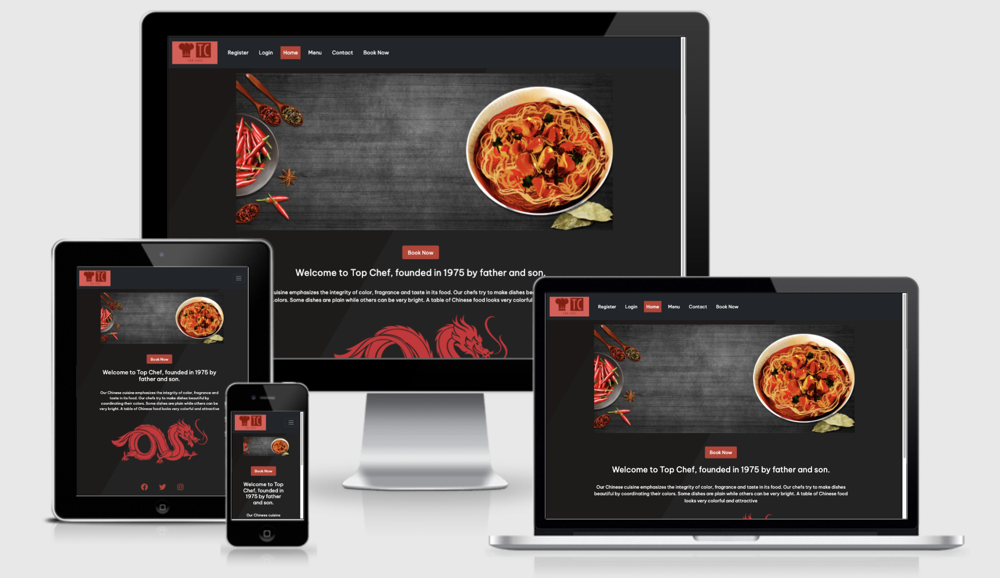
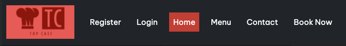
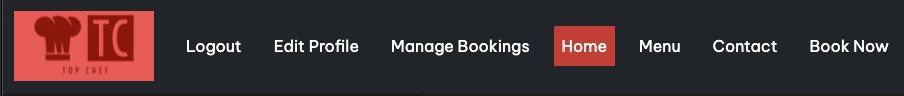
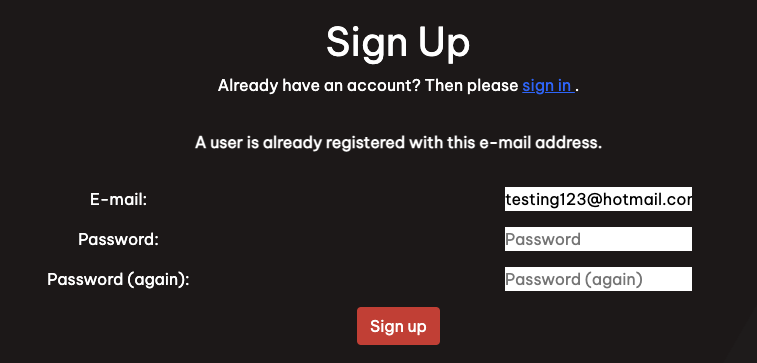
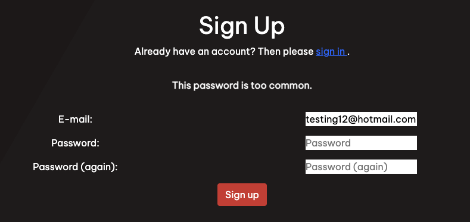
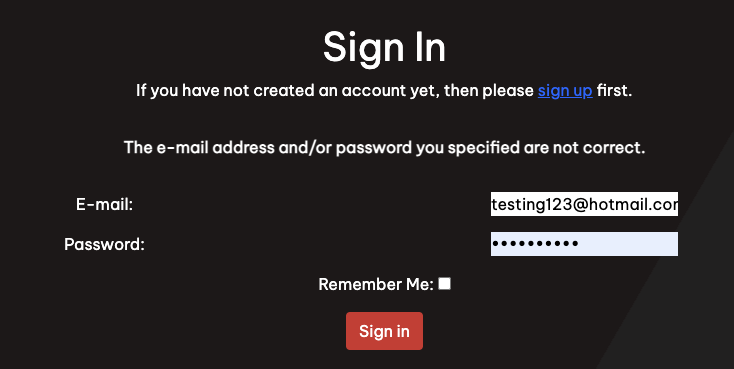
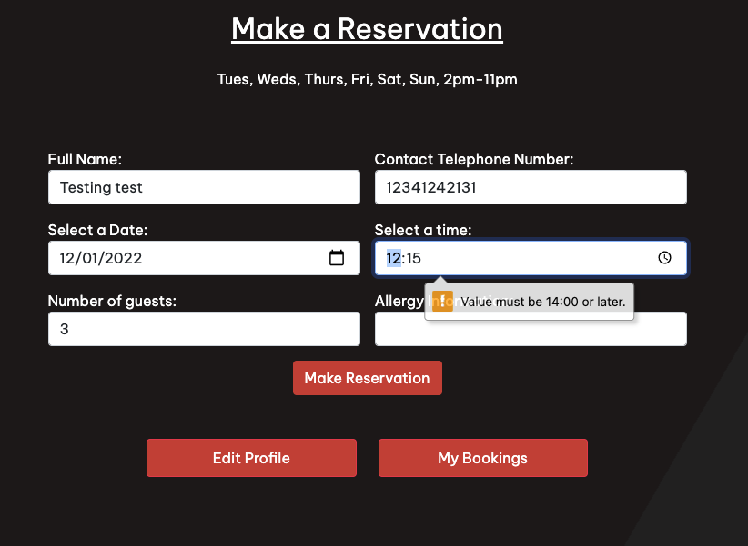
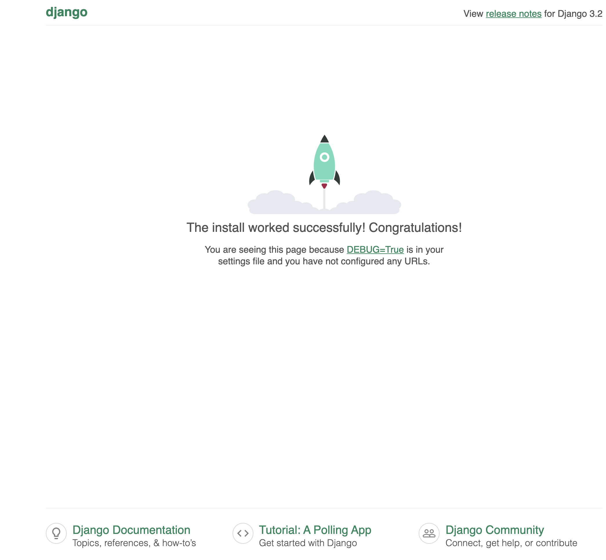

# Restaurant Booking System

## Introduction
Welcome to my fourth project. This project is a simple restaurant booking system, allow users to booking a table for this restauarant. This will use languages such as Django, Python, HTML and CSS.

A live website can be found [here]().

# Table of Contents

-   [1. UX](#ux)
    -   [1.1. Strategy](#strategy)
        -   [Project Goals](#project-goals)
            -   [User Goals:](#user-goals)
            -   [User Expectations:](#user-expectations)
            -   [Trends of Modern Websites](#trends-of-modern-websites)
            -   [Strategy Table](#strategy-table)
    -   [1.2. Structure](#structure)
    -   [1.3. Skeleton](#skeleton)
    -   [1.4. Surface](#surface)
-   [2. Features](#features)
-   [3. Technologies Used](#technologies-used)
-   [4. Testing](#testing)
-   [5. Development Cycle](#development-cycle)
-   [6. Deployment](#deployment)
-   [7. End Product](#end-product)
-   [8. Known Bugs](#known-bugs)
-   [9. Credits](#credits)

# 1. UX

[Go to the top](#table-of-contents)

As a big foodie, I have always enjoyed going out to different restuarants to try new cuisines. The simplest way is to book a table at restaurants. The booking system is best when its simple to use and asks for the necessary information.

This project will showcase simplicity and ease to booking a table, update a booking, create a personal profile and to update a profile.

## 1.1. Strategy

[Go to the top](#table-of-contents)

### Project Goals
The main goal of this project is to allow the user to sign up, sign in/out, create/update a user profile and to create/update/delete a table booking in a simple and effective process.

### User Goals:
First Time Visitor Goals
-   As a first-time visitor, I want to book a table at my chosen date and time.
-   As a first-time visitor, I want to view the menu for the restaurant, so that i can make a decision to book a table or not.
-   As a first-time visitor, I want to be able to get the contact details of the restaurant with ease.

Returning Visitor Goals
-   As a Returning Visitor, I want to update my booking details.
-   As a Returning Visitor, I want to cancel a booking i have already made.
-   As a Returning Visitor, I want to edit my profile for any future bookings.

Frequent User Goals
-   As a Frequent User, I want to check to see if there are any new food items on the menu.

### User Expectations:
The system should have a simple user interface, with the navigation to each section clear and concise.

-   The menu is clear to read.
-   The user interface is easy to navigate.
-   The website is responsive on all devices.
-   To have the ability to contact the restaurant for any enquiries.

### Strategy Table
Opportunity/Problem/Feature| Importance| Viability/Feasibility
------------ | -------------------------|---------
Display a food Menu | 5 | 5
Account signup | 5 | 5
User profile | 5 | 5
Responsive design | 5 | 5
Contact form | 4 | 5
Ability to create a booking | 5 | 4
Ability to update a booking | 5 | 4
Ability to cancel a booking | 3 | 4
Multiple table occupancies | 4 | 1
Avoid double bookings | 4 | 1

Total | 45 | 39

## Scope
As I am unable to include all of the features from the strategy table. I will phase this project in multiple phases. Phase 1 will be what I have identified as a minimum viable product. Please find below the plans I have for each phase.

### Phase 1
- Display a food menu
- Allow users to register for an account
- Allow users to create and edit a personal profile
- Responsive design
- Contact form
- Ability to create a booking
- Ability to update a booking
- Ability to cancel a booking

### Phase 2
- Multiple table occupancies
- Avoid double bookings

## 1.2. Structure

[Go to the top](#table-of-contents)

It is really important to include responsive design in this project as many users are using different devices (mobile, tablet, laptop/PC). This gives the user the best experience on their device.

Responsive on all device sizes
Easy navigation through labelled buttons
Footer at the bottom of the index page that links to the social media website.
All elements will be consistent including font size, font family, colour scheme.

## 1.3. Skeleton

[Go to the top](#table-of-contents)

### Wire-frames
Home/Landing Page Desktop:

Home/Landing Page Mobile:

Navigation Bar Mobile:

Menu Page Desktop:

Menu Page Mobile:

Register Page Desktop:

Register Page Mobile:

Login Page Desktop:

Login Page Mobile:

User Logged In Desktop:

User Logged In Mobile:

Online Booking Page Desktop:

Online Booking Page Mobile:

Contact Page Desktop:

Contact Page Mobile 1:

Contact Page Mobile 2:

Edit Profile Page Desktop:

Edit Profile Page Mobile:

Manage Booking Page Desktop:

Manage Booking Page Mobile:

## 1.4. Surface

[Go to the top](#table-of-contents)

### Colours

Please find the colours schemes that I used [here](https://coolors.co/bd3c31-000000-ffffff-212529).

### Typography

I decided to use Be Vietnam Pro as my font of choice with sans serif as my backup font for browsers that might not support Be Vietnam Pro.

The link to the font can be found [here](https://fonts.google.com/share?selection.family=Be%20Vietnam%20Pro).

# 2. Features

[Go to the top](#table-of-contents)

### All Pages
- The navgiation bar is placed at the top of all pages. The navigation bar is dynamic in that meaning depending on if the user is logged in or not the options will change.
- If the user is not logged in the navigation bar will look like this:

- If the user is logged in the navigation bar will look like this:

- The restaurant logo is also placed at the top of all pages. Clicking on it will also direct the user to the home page.
- Animated background, to give more of a user experience instead of a plain static background.

### Register Page
- A simple signup form for that requires the user to enter a unique email address and a password. The password must be entered again for confirmation, this must match the already entered password above.
- A message to prompt the user that if an account is already been created they can click the sign in hyperlink to be redirected to the sign in page.
- If the user enters an email address that has already been registered, the user is prompted by a error message.

- If the user enters a password that it not secure, the user will be prompted by a message.

- If the user enters both passwords that do not match, the user is prompted by a message.

- Once the user has successfully signed up, this will automatically login and direct the user to the create profile page.

### Login Page
- A login form that requires the user to enter their email address and password that they used when signing up to the site.
- A message to prompt the user that if an account has not been created they can click the sign up hyperlink to be redirected to the sign up page.
- If the user enters in the wrong credentials, a message is displayed to the user.

### Logout Page
- When clicking logout from the navigation bar, the user is redirected to a sign out page to confirm their action.

### Landing Page
- A simple but elegant banner to give the user a sense of the restaurant.
- A book now button that directs the user to the create a booking page. If the user has not logged in it will prompt the user to register or login first.
- A short introduction to describe the restaurant.

### Create Profile Page
- Once the user has registered they will be redirects to the create profile page. The page displays a form for the user to enter their first name, last name and telephone number.

### Edit Profile Page
- The user can navigate to this page by clicking on the edit profile link in the navigation bar. This page will display the current profile details with a form below for the user to update any details.

### Menu Page
- The restaurant opening times is displayed at the top of the page.
- A menu that is displayed in 3 sections by the food category.

### Contact Page
- An information section that displays the restaurant telephone number, email address, opening times and address.
- A contact form that requires the user to enter their full name, email address and a message. The form is aldready pre-filled with the users full name (if the user is logged in and has created a profile).
- A Google maps iframe of the restaurant location.

### Create Booking Page
- A form that requires the user to enter/select the booking details.
Full name and contact telephone number is prefilled if the user has created a profile.
The user will then need to select a date, time, number of guests and enter any allergy information if needed.
- When clicking the make reservation button the booking will then be requested to the restaurant owner for approval.
- As the restaurant is only open from 2PM, if the user selects a time before that, the form will display an error, prompting the customer to select a later time.

### Manage Booking Page
- Displays all user related bookings in a list view within a card.
- Each card will show a booking reference, booking status, booking date, booking time, guest count. It will also contain a button to change booking details and a cancel booking button.

### Edit Booking Page
- This page will display the current booking details with a form below for the user to update any details.
- When the changes are submitted, the booking will be processed as the booking requested status.

### Cancel Booking
- When the user clicks the cancel booking button they will be redirected to a confirmation page.

## 3. Technologies Used

[Go to the top](#table-of-contents)

-   [HTML5](https://en.wikipedia.org/wiki/HTML)
    -   The project uses HyperText Markup Language.
-   [CSS3](https://en.wikipedia.org/wiki/CSS)
    -   The project uses Cascading Style Sheets.
-   [JavaScript](https://en.wikipedia.org/wiki/JavaScript)
    -   The project uses JavaScript.
-   [Python](https://en.wikipedia.org/wiki/Python_(programming_language))
    -   The project uses Python.
-   [Boostrap 5](https://getbootstrap.com/docs/5.0/getting-started/introduction/)
    -   The project uses Bootstrap 5.
-   [Gitpod](https://www.gitpod.io/)
    -   The project uses Gitpod.
-   [Chrome](https://www.google.com/intl/en_uk/chrome/)
    -   The project uses Chrome to debug and test the source code using HTML5.
-   [Balsamiq](https://balsamiq.com/)
    -   Balsamiq was used to create the wireframes during the design process.
-   [Google Fonts](https://fonts.google.com/)
    -   Google fonts were used to import the "Benne" font into the style.css file which is used on all pages throughout the project.
-   [GitHub](https://github.com/)
    -   GitHub was used to store the project's code after being pushed from Git.

# 4. Testing

[Go to the top](#table-of-contents)

For every element that I added to my HTML, I would add the basic CSS to my stylesheet. I would then use the inspect element to try different styles. Once I've got it to my liking I would try to see if I can implement the styling with bootstrap, if I could not replicate the styling I would copy the CSS from google and paste into my css stylesheet. This allows me to keep track of the code I am using.

### Google Developer Tools

### Responsive Tools

### W3C Validator Tools

## Manual Testing

# 5. Development Cycle

[Go to the top](#table-of-contents)

## Project Checklist
- Install Django and the supporting libaries
    -  Install Django and Gunicorn. Gunicorn is the server I am using to run Django on Heroku.
    - Install support libaries including psycopg2, this is used to connect the the PostgreSQL databse
    - Install Cloudinary libaries, this is a host provider service that stores images
    - Create the requirements.txt file. This is includes the projects dependecies allowing us to run the project in Heroku.

- Create a new, blank Django Project
    - Create a new project
    - Create the app
    - Add restaurant_booking to the installed apps in settings.py
    - Migrate all new changes to the database
    - Run the server to test

- Setup project to use Cloudinary and PostgreSQL
    - Create new Heroku app
        - Sign into Heroku
        - Select New
        - Select create new app
        - Enter a relevant app name
        - Select appropriate region
        - Select the create app button

    - Attach PostgreSQL database
        - In Heroku go to resources
        - Search for Postgres in the add-ons box
        - Select Heroku Postgres
        - Submit order form

    - Prepare environment and settings.py file
        - Create env.py file
        - Add DATABASE_URL with the Postgres URL from Heroku
        - Add SECRET_KEY with a randomly generated key
        - Add SECRET_KEY and generated key to the config vars in Heroku
        - Add if statement to settings.py to prevent the production server from erroring
        - Replace insecure key with the enviroment variable for the SECRET_KEY
        - Add Heroku database as the back end
        - Migrate changes to new databse

    - Get static media files stored on Cloudinary
        - Create Cloudinary account
        - From the dashboard, copy the API Environment variable
        - In the settings.py file create a new enviroment variable for CLOUDINARY_URL
        - Add the CLOUDINARY_URL variable to Heroku
        - Add a temporary config var for DISABLE_COLLECTSTATIC
        - In settings.py add Cloudinary as an installed app
        - Add static and media file variables
        - Add templates directory
        - Change DIR's key to point to TEMPALTES_DIR
        - Add Heroku host name to allowed hosts
        - Create directories for media, static and templates in project workspace
        - Create a Procfile

- Deploy new empty project to Heroku

# 6. Deployment

[Go to the top](#table-of-contents)

# 7. End Product

[Go to the top](#table-of-contents)

# 8. Known Bugs

[Go to the top](#table-of-contents)

# 9. Credits

[Go to the top](#table-of-contents)

### Code

### Content
