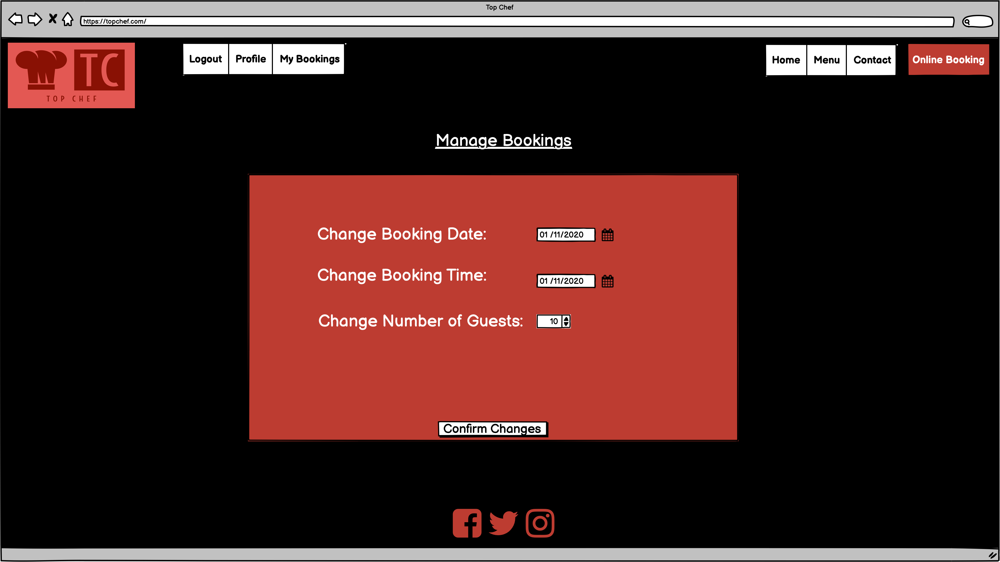

# Restaurant Booking System

## Introduction
Welcome to my fourth project. This project is a simple restaurant booking system, allow users to booking a table for this restauarant. This will use languages such as Django, Python, HTML and CSS.

A live website can be found [here]().

# Table of Contents

-   [1. UX](#ux)
    -   [1.1. Strategy](#strategy)
        -   [Project Goals](#project-goals)
            -   [User Goals:](#user-goals)
            -   [User Expectations:](#user-expectations)
            -   [Trends of Modern Websites](#trends-of-modern-websites)
            -   [Strategy Table](#strategy-table)
    -   [1.2. Structure](#structure)
    -   [1.3. Skeleton](#skeleton)
    -   [1.4. Surface](#surface)
-   [2. Features](#features)
-   [3. Technologies Used](#technologies-used)
-   [4. Testing](#testing)
-   [5. Development Cycle](#development-cycle)
-   [6. Deployment](#deployment)
-   [7. End Product](#end-product)
-   [8. Known Bugs](#known-bugs)
-   [9. Credits](#credits)

# 1. UX

[Go to the top](#table-of-contents)

As a big foodie, I have always enjoyed going out to different restuarants to try new cuisines. The simplest way is to book a table at restaurants. The booking system is best when its simple to use and asks for the necessary information.

This project will showcase simplicity and ease to booking a table, update a booking, create a personal profile and to update a profile.

## 1.1. Strategy

[Go to the top](#table-of-contents)

### Project Goals
The main goal of this project is to allow the user to sign up, sign in/out, create/update a user profile and to create/update/delete a table booking in a simple and effective process.

### User Goals:
First Time Visitor Goals
-   As a first-time visitor, I want to book a table at my chosen date and time.
-   As a first-time visitor, I want to view the menu for the restaurant, so that i can make a decision to book a table or not.
-   As a first-time visitor, I want to be able to get the contact details of the restaurant with ease.

Returning Visitor Goals
-   As a Returning Visitor, I want to update my booking details.
-   As a Returning Visitor, I want to cancel a booking i have already made.
-   As a Returning Visitor, I want to edit my profile for any future bookings.

Frequent User Goals
-   As a Frequent User, I want to check to see if there are any new food items on the menu.

### User Expectations:
The system should have a simple user interface, with the navigation to each section clear and concise.

-   The menu is clear to read.
-   The user interface is easy to navigate.
-   The website is responsive on all devices.
-   To have the ability to contact the restaurant for any enquiries.

### Strategy Table
Opportunity/Problem/Feature| Importance| Viability/Feasibility
------------ | -------------------------|---------
Display a food Menu | 5 | 5
Account signup | 5 | 5
User profile | 5 | 5
Responsive design | 5 | 5
Contact me form | 4 | 5
Ability to create a booking | 5 | 4
Ability to update a booking | 5 | 4
Ability to cancel a booking | 3 | 4
Multiple Table Occupancies | 4 | 1
Avoid double bookings | 4 | 1

Total | 45 | 39

## Scope

## 1.2. Structure

[Go to the top](#table-of-contents)

## 1.3. Skeleton

[Go to the top](#table-of-contents)

### Wire-frames
Home/Landing Page Desktop:

Home/Landing Page Mobile:

Navigation Bar Mobile:

Menu Page Desktop:

Menu Page Mobile:

Register Page Desktop:

Register Page Mobile:

Login Page Desktop:

Login Page Mobile:

User Logged In Desktop:

User Logged In Mobile:

Online Booking Page Desktop:

Online Booking Page Mobile:

Contact Page Desktop:

Contact Page Mobile 1:

Contact Page Mobile 2:

Edit Profile Page Desktop:

Edit Profile Page Mobile:

Manage Booking Page Desktop:

Manage Booking Page Mobile:

## 1.4. Surface

[Go to the top](#table-of-contents)

# 2. Features

[Go to the top](#table-of-contents)

## 3. Technologies Used

[Go to the top](#table-of-contents)

# 4. Testing

[Go to the top](#table-of-contents)

### Google Developer Tools

### Responsive Tools

### W3C Validator Tools

## Manual Testing

# 5. Development Cycle

[Go to the top](#table-of-contents)

## Project Checklist
- Install Django and the supporting libaries
    -  Install Django and Gunicorn. Gunicorn is the server I am using to run Django on Heroku.
    - Install support libaries including psycopg2, this is used to connect the the PostgreSQL databse
    - Install Cloudinary libaries, this is a host provider service that stores images
    - Create the requirements.txt file. This is includes the projects dependecies allowing us to run the project in Heroku.

- Create a new, blank Django Project
    - Create a new project
    - Create the app
    - Add restaurant_booking to the installed apps in settings.py
    - Migrate all new changes to the database
    - Run the server to test

    !!! INSERT TEST SUCCESSFUL IMAGE !!! 

- Setup project to use Cloudinary and PostgreSQL
    - Create new Heroku app
        - Sign into Heroku
        - Select New
        - Select create new app
        - Enter a relevant app name
        - Select appropriate region
        - Select the create app button

    - Attach PostgreSQL database
        - In Heroku go to resources
        - Search for Postgres in the add-ons box
        - Select Heroku Postgres
        - Submit order form

    - Prepare environment and settings.py file
        - Create env.py file
        - Add DATABASE_URL with the Postgres URL from Heroku
        - Add SECRET_KEY with a randomly generated key
        - Add SECRET_KEY and generated key to the config vars in Heroku
        - Add if statement to settings.py to prevent the production server from erroring
        - Replace insecure key with the enviroment variable for the SECRET_KEY
        - Add Heroku database as the back end
        - Migrate changes to new databse

    - Get static media files stored on Cloudinary
        - Create Cloudinary account
        - From the dashboard, copy the API Environment variable
        - In the settings.py file create a new enviroment variable for CLOUDINARY_URL
        - Add the CLOUDINARY_URL variable to Heroku
        - Add a temporary config var for DISABLE_COLLECTSTATIC
        - In settings.py add Cloudinary as an installed app
        - Add static and media file variables
        - Add templates directory
        - Change DIR's key to point to TEMPALTES_DIR
        - Add Heroku host name to allowed hosts
        - Create directories for media, static and templates in project workspace
        - Create a Procfile

- Deploy new empty project to Heroku

# 6. Deployment

[Go to the top](#table-of-contents)

# 7. End Product

[Go to the top](#table-of-contents)

# 8. Known Bugs

[Go to the top](#table-of-contents)

# 9. Credits

[Go to the top](#table-of-contents)

### Code

### Content
